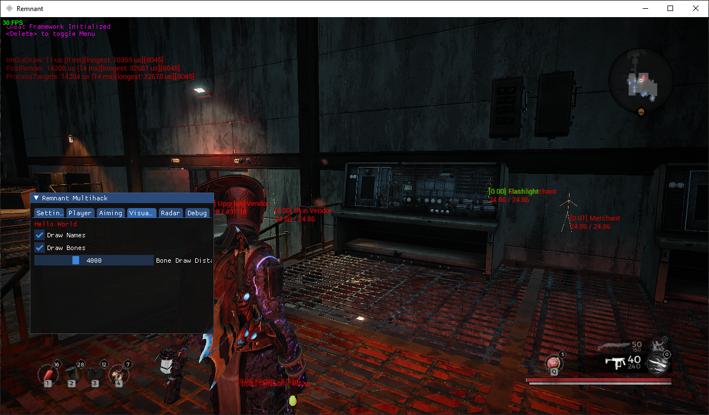

# remnant-multihack-ue4

A mod menu for Remnant: From the Ashes (Steam version). 
The beginnings of a multi-engine modding framework, too, if I ever get around to it.

## Disclaimer

**This is for educational purposes only.**

Videogames provide a great medium for programmers to improve their skills through designing and implementing many complex systems that must be performant and act cohesively. 
In turn, videogames also serve as a great medium for fledgling reverse engineers to learn the ropes and gain practical experience picking apart those complex systems and exploiting them.

## Screenshot

|  |
|:--:|
| Image: Name and Bone ESP, with the menu open | 

## Features

- Name ESP
- Bone ESP
- Bone aim assist
- Give player scrap

## How To Use

1. Build from source
2. Place the loose *.txt files into the game directory
3. Inject the DLL into `Remnant-Win64-Shipping.exe` using your favorite injector
    - Please note that Remnant.exe is NOT the one you want
4. Pause the game and press the `Delete` key on your keyboard to bring up the imgui menu
    - You must pause the game to spawn the cursor (feel free to implement your own cursor to remove this need)

## How To Contribute

1. Fork it (https://github.com/kotae4/remnant-multihack-ue4/fork)
2. Create your feature branch (`git checkout -b feature/fooBar`)
3. Commit your changes (`git commit -am 'Add some fooBar'`)
4. Push to the branch (`git push origin feature/fooBar`)
5. Create a new Pull Request
